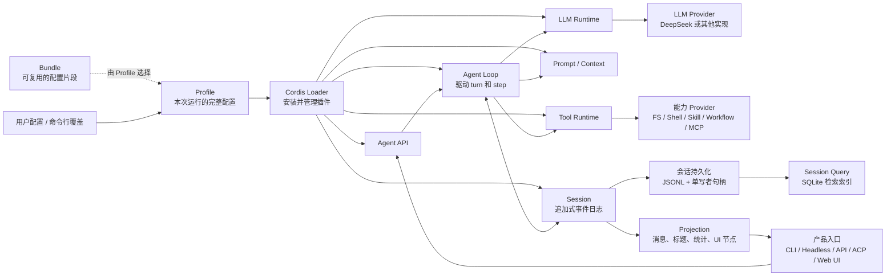

# 系统总览

## 系统架构图

Profile 决定本次启动安装哪些插件。Loader 根据 Profile 创建运行时；Agent Loop 通过统一接口调用 Prompt、LLM 和工具，并把模型可见事实写入 Session。模型 Provider、工具 Provider、存储和界面都可以替换，但必须遵守对应接口、事件格式、作用域和生命周期规则。

## Agent 接口与默认循环

从目录看，`packages/core/agent-loop` 像传统 Agent 框架的中心；从依赖和运行时看，它只是 `Agent` 接口的一个具体驱动。`packages/core/agent` 提供实时 Agent 注册表和接口，`packages/core/session` 提供持久事实，`packages/core/tools` 与 `packages/llm/llm` 提供能力注册表，最终由 [bundle patch](../../packages/bundle/base/cordis.patch.yml)把它们装成一个产品。UI、ACP 或 headless 只是同一能力树的不同叶节点。

这一区分决定了扩展方向：插件不应导入具体循环来“插入逻辑”，而应监听 `agent/*`、`tools/*`、`llm/*` 事件，注册 Service Provider，或添加 Session Event。默认 Loop 只维护普遍成立的 turn/step 语义。

## 五类组件分别保存什么

| 类别 | 由谁保存最终状态 | 主要机制 | 典型包 |
|---|---|---|---|
| 启动配置 | Loader 生成的 Cordis entry 树 | profile、bundle、patch、Loader | `boot/`、`bundle/`、`preset/` |
| 当前运行状态 | Agent、inbox、取消信号、注册表 | Service、typed event、waterfall、scope | `core/agent`、`core/agent-loop` |
| 会话记录 | `SessionEvent[]` | append、校验、派生、fork | `core/session`、`session/*` |
| 可替换能力 | Definition/Provider/Consumer 注册 | Service key、provider registry、tool | `llm/`、`fs/`、`shell/`、`subagent/` 等 |
| 展示与集成 | Session Log 和服务端远程对象保存业务事实；客户端只拥有临时交互状态和视图偏好 | projection、Typert、RPC、client module | `api/`、`sdk/`、`host/`、`client/` |

这些职责有意分开。Session Store 不负责写磁盘，Agent Registry 不运行具体循环，工具注册表不渲染 UI，Web Client 也不保存独立业务状态。这样可以单独替换存储、循环或界面，但新增一个完整功能通常要同时补齐其中几类组件。

## 包之间怎样依赖

Consumer 只依赖 Service Definition，不依赖具体 Provider。只有负责装配的 bundle 可以同时依赖三者。以文件系统为例：`dsh-fs` 定义接口；`dsh-fs-local`、`dsh-fs-e2b`、`dsh-fs-sandbox` 提供实现或包装；`dsh-tool-fs` 和搜索/编辑工具使用接口；`dsh-base` 选择实际安装哪些包。见[能力接缝文档](../../docs/capability-seams.md)和[模块依赖图](../../docs/module-graph.md)。

该方向避免工具绑定本地 Node API，也让一次 provider 替换同时移动 Bash、Terminal 和 LSP 所在的执行环境。代价是“一个功能一个包”不再成立；能力的完整含义分布在角色包和组合配置中。

## 两套事件，不同职责

`session/event` 通知监听者：某个事件已经写入日志。持久化、统计和 UI 可以据此更新。`agent/*`、`tools/*`、`llm/*` 等 Cordis 事件协调正在发生的操作，允许观察、修改或阻止。前者能保存和重放；后者可能携带 Promise、对象实例或取消信号，只在当前进程有效。

Waterfall 事件表示可拦截的调用链，listener 必须调用 `next()` 才能委托；普通 emit 表示通知；serial 表示有序观察但不可替换调用。这些模式直接影响扩展是否短路核心行为。

## 谁负责哪些状态

- `Session` 拥有有序事件和派生缓存，但 persistence plugin 拥有存储策略。
- `ReactLoopAgent` 保存一个 Agent 的 phase、inbox 和 AbortController，并负责等待 driver 停止。
- 创建者持有 `AgentHandle.dispose()`；Agent Loop provider 也是结构性所有者，卸载时释放它创建的全部 Agent。
- 每个注册项都属于创建它的 fiber/effect，卸载该插件时自动删除。
- Conversation UI、查询、统计和标题从日志或服务端 projection 计算，不能各自保存另一份会话事实；Settings、Workspace 等非 Session 领域使用自己的服务端存储，客户端可以保留展开状态、筛选和排序方式等视图偏好。

阅读实现时，遇到缓存、Promise、listener 或 map，先确认谁创建它、何时算提交、取消后由谁等待结束、最后由谁清理。
