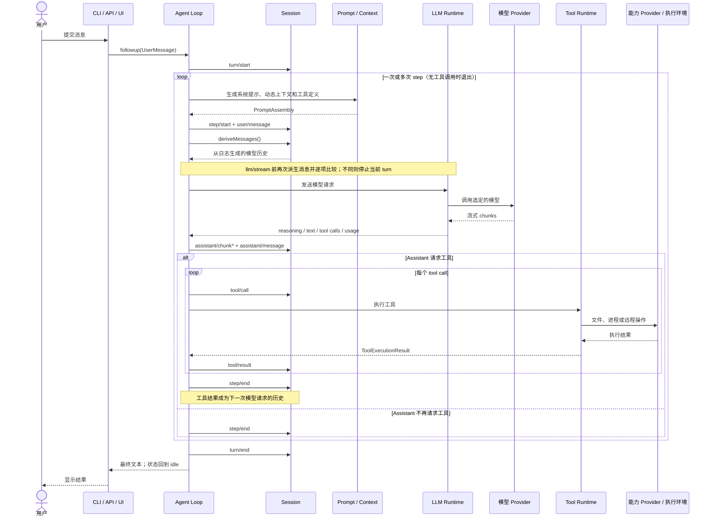

# Agent Runtime 与默认循环

## 接口与实现分离

[`dsh-agent`](../../packages/core/agent/src/index.ts)定义 Agent、Agent Registry、创建/恢复接口、实时事件和 initiator scope；[`dsh-agent-loop`](../../packages/core/agent-loop/src/index.ts)提供 `ReactLoopAgent` 与 factory。ACP、UI、subagent 等 Consumer 依赖前者，不依赖默认循环。替换循环只要维持 Agent 与 Session 语义即可。

Agent 与 Session 共用同一个 branded `SessionId`，避免跨 registry 的字符串误配。`AgentHandle` 只交给创建者，裸 `Agent` 可从 registry 查询但没有销毁权限。factory provider 仍是结构性所有者：自身卸载时停止并 drain 全部 live handle。

## Phase 状态机

[`ReactLoopAgent`](../../packages/core/agent-loop/src/agent.ts)只有三类 phase：`idle`、`maintenance`、`running`。running 持有当前 turn/step、AbortController 和 wake latch；maintenance 允许标题或其他独占维护工作；idle 保存最后 turn。状态转换统一经 `setPhase()` 发布 `agent/status`。

`activityDone` 不只是当前 Promise：`whenIdle()` 循环比较引用，防止一个活动完成回调立刻启动下一活动时过早返回。取消会清 inbox（除非 `keepInbox`）并 abort 当前 controller，但 driver 在边界内捕获错误、写完 `turn/end`，再回到 idle。

## Inbox 的三种输入语义

- `followup()` 插入 `next-turn` 并唤醒：当前工作完成后开始新 turn。
- `steer()` 插入 `next-step` 并唤醒：工具调用后的下一 step 可以消费。
- `inject()` 插入 `next-step` 但不唤醒：只有其他输入启动工作时才进入模型上下文。

当前活动取消后才到达的 waking input 会改为 `next-turn`，避免加入已经终止的 turn；维护期间或 driver 已取消时，latch 会记住 wake，并在当前工作停止后重新触发。Inbox 因此不仅保存输入，还决定输入进入当前 turn 的下一 step，还是开始下一个 turn。实现在 [`inbox.ts`](../../packages/core/agent/src/inbox.ts)。

## 一次 Turn

下图从 Profile 和插件已经加载完成、Agent 可以对外使用时开始。一个 turn 可以包含多个 step；模型请求工具后，工具结果会进入日志，然后同一 turn 开始下一个 step。

Turn 在 claim 第一个输入前就打开，所以 waking message 被 listener 删除、first pre-step 被拒绝或改写为空时，日志仍记录一个没有 step 的 turn。这保存“系统曾尝试处理输入”的事实，也让 turn 序号单调。

每个 step 在 `finally` 写 `step/end`；每个 turn 在 `finally` 写带结构化原因的 `turn/end`。原因区分 completed、max-tokens、blocked、aborted 和 error。max-tokens 是 sticky 结果，后续工具引发的 step 正常结束不能把它降级为 completed。

## 一次请求怎样继续到下一步

Step 从 prompt assembly 生成 system prompt，但历史消息只能由 `session.deriveMessages()` 得到。`agent/request` waterfall 负责最终 provider/model 和请求配置；LLM chunk 先逐个落日志，再由 `BlockAssembler` 形成 assistant message。这样 UI 可实时呈现原始 chunk，恢复时又使用稳定 message。

assistant message 中的 tool calls 交给 scheduler；结果成为 Session Event，若工具要求下一请求或 `next-step` 有输入，循环继续同一 turn。`agent/turn-stopping` 是最后一次补充工作的机会；它是 serial event，不能用不调用 `next()` 的方式意外截断关闭。

## 失败与取消

Provider failure 统一转换为 `LlmFailure`，`agent/request-error` 可按 retry policy 决定重试；未知异常转换为 `UNKNOWN`。取消信号会传给 prompt assembly、listener、LLM 和工具，但已经开始的工具仍要等到结束，防止 turn 结束后旧工具继续写文件或发布事件。Agent driver 会截住已经记录过的错误，避免单个 Agent 的失败终止整个插件任务。
