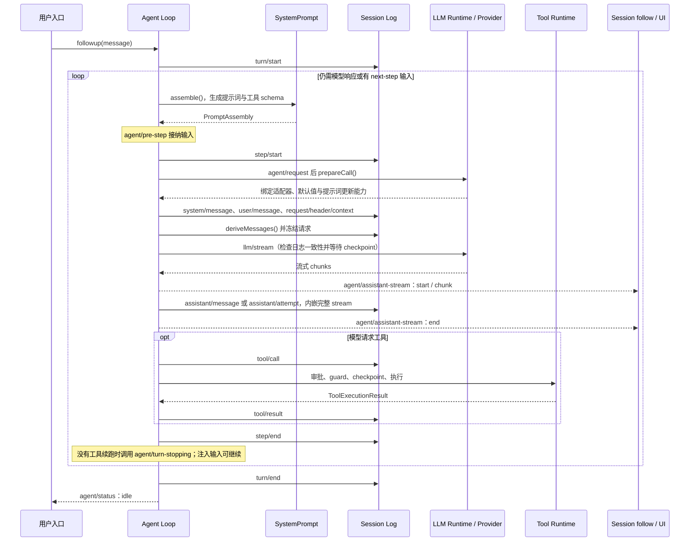

# Agent Runtime 与默认循环

## 接口与实现分离

[`dsh-agent`](../../packages/core/agent/src/index.ts)定义 Agent、Agent Registry、创建/恢复接口、实时事件和 initiator scope；[`dsh-agent-loop`](../../packages/core/agent-loop/src/index.ts)提供 `ReactLoopAgent` 与 factory。ACP、UI、subagent 等 Consumer 依赖前者，不依赖默认循环。替换循环只要维持 Agent 与 Session 语义即可。

Agent 与 Session 共用同一个 branded `SessionId`，避免跨 registry 的字符串误配。`AgentHandle` 只交给创建者，裸 `Agent` 可从 registry 查询但没有销毁权限。factory provider 仍是结构性所有者：自身卸载时停止并 drain 全部 live handle。

## Phase 状态机

[`ReactLoopAgent`](../../packages/core/agent-loop/src/agent.ts)只有三类 phase：`idle`、`maintenance`、`running`。running 持有当前 turn/step、AbortController 和 wake latch；maintenance 允许标题或其他独占维护工作；idle 保存最后 turn。状态转换统一经 `setPhase()` 发布 `agent/status`。

`activityDone` 不只是当前 Promise：`whenIdle()` 循环比较引用，防止一个活动完成回调立刻启动下一活动时过早返回。取消会清 inbox（除非 `keepInbox`）并 abort 当前 controller，但 driver 在边界内捕获错误、写完 `turn/end`，再回到 idle。

## Inbox 的三种输入语义

- `followup()` 插入 `next-turn` 并唤醒：当前工作完成后开始新 turn。
- `steer()` 插入 `next-step` 并唤醒：工具调用后的下一 step 可以消费。
- `inject()` 插入 `next-step` 但不唤醒：正在运行的 turn 可在下一 step 消费；Agent 空闲时等待其他输入唤醒。

Inbox 的变更记录为 `agent/inbox/spliced`，pending 输入可由 Session 投影重建；被领取且通过 pre-step 的输入才成为模型历史中的 `user/message`。

当前活动取消后才到达的 waking input 会改为 `next-turn`，避免加入已经终止的 turn；维护期间或 driver 已取消时，latch 会记住 wake，并在当前工作停止后重新触发。Inbox 因此不仅保存输入，还决定输入进入当前 turn 的下一 step，还是开始下一个 turn。实现在 [`inbox.ts`](../../packages/core/agent-loop/src/inbox.ts)。

## 从创建会话到接收输入

Web Session controller 先解析 preset 和模型选择，再通过 `ctx.agents.create()` 或 `ctx.agents.resume()` 安装 Agent。Factory 准备私有 Session、写句柄与 `agent.ctx`，执行 setup 并存储期间产生的事件，然后才发布 Session 和 Agent、发出生命周期通知并启动 driver。安装失败不会暴露半配置的 Agent。恢复时，controller 根据 Session 投影选择 preset，factory 则负责读日志和修复中断轮次。

```text
Session controller → 解析 preset / 模型选择
  → agents.create / agents.resume
  → 准备 Session、写句柄、agent.ctx
  → setup 挂载 preset → 存储 setup 事件
  → 发布 Session 与 Agent → 启动 driver → 接收 inbox 输入
```

## 一次 Turn

下图展示输入获准后的请求与工具循环。首次输入可被 `agent/pre-step` 拒绝或改写为空，此时保留 `turn/start` 与 `turn/end`，不创建 step。图中省略取消和重试分支，失败规则见后文。



每个 step 在 `finally` 写 `step/end`，每个 turn 在 `finally` 写结构化 `turn/end`。原因区分 completed、max-tokens、blocked、aborted 和 error。某一步达到 max-tokens 后，同轮后续步骤正常结束也不会将整轮结果降为 completed。

## 一次请求怎样继续到下一步

Step 先组装提示词并经过 `agent/pre-step`，再由 `agent/request` 和 `prepareCall()` 确定实际路由。系统提示词以 `system/message` 进入日志，获准输入以 `user/message` 进入日志；随后派生并冻结请求。在路由准备期间取消不会提交系统提示词或用户消息。`BlockAssembler` 组装流式响应，实时 chunk 通过 `agent/assistant-stream` 通知 UI；完整尝试结束时才把紧凑流嵌入 `assistant/message` 或 `assistant/attempt`。重试复用本步骤的组装结果，不重复提交用户输入。

assistant message 中的 tool calls 交给 scheduler；结果成为 Session Event，若工具要求下一请求或 `next-step` 有输入，循环继续同一 turn。`agent/turn-stopping` 是最后一次补充工作的机会；它是 serial event，不能用不调用 `next()` 的方式意外截断关闭。

## 失败与取消

Provider failure 统一转换为 `LlmFailure`，`agent/request-error` 可按 retry policy 决定重试；未知异常转换为 `UNKNOWN`。取消信号会传给 prompt assembly、listener、LLM 和工具，但已经开始的工具仍要等到结束，防止 turn 结束后旧工具继续写文件或发布事件。Agent driver 会截住已经记录过的错误，避免单个 Agent 的失败终止整个插件任务。
