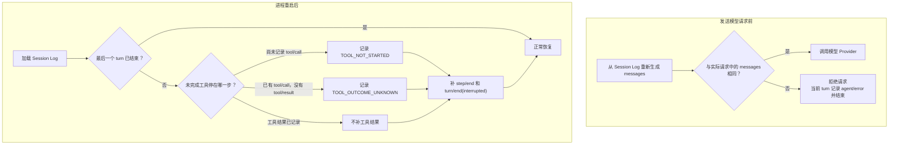

# Session Event Log

## 为什么需要 Session Log

Session Log 首先解决恢复问题：进程崩溃或重启后，模型必须看到与之前相同的会话历史。如果插件只在内存中插入消息，恢复后这条消息会消失；如果工具已经产生外部影响却没有留下完整记录，模型可能再次执行它。

DSH 不可能仅凭日志判断一个外部操作是否真的完成。例如，进程可能在文件已经写入、工具结果尚未保存时崩溃。因此它不自动重试结果未知的工具，而是记录“不知道结果”，让后续模型先检查外部状态或询问用户。



这两条路径都不会让系统“假装一切正常”。发送前发现消息不一致时，只停止当前 Agent 的 turn；重启发现工具结果不确定时，明确把不确定性写进日志，而不是盲目重试。

## 发送模型请求前比较消息

[`Session`](../../packages/core/session/src/index.ts)维护只追加事件数组、序号、模型消息缓存和 metadata。默认 Loop 不另存一份 conversation history；每次请求都调用 `deriveMessages()`，按 [`surface.ts`](../../packages/core/session/src/surface.ts) 中的规则从事件生成模型消息。

请求进入 `llm/stream` 时，[`agent-loop` 的运行时检查](../../packages/core/agent-loop/src/invariant.ts)再次调用 `deriveMessages()`，然后把结果与请求中的 `messages` 比较。两者不同就抛出 `InvariantError`，不会继续调用模型 Provider。Agent Loop 会发送 `agent/error`、结束当前 turn，并在最外层 driver 接住错误；Agent 随后回到 idle，整个 DSH 进程和其他 Agent 继续运行。检查还比较 model、temperature、最大 token 数、stop 和 tools 与 `request/header` 是否一致，并要求请求不携带独立 `system` 字段；系统提示词已经包含在日志派生的 `messages` 中。

## 写入事件前检查顺序

[`session` 的运行时检查](../../packages/core/session/src/invariant.ts)为每个 Session 记录当前打开的 turn、当前打开的 step、下一个编号，以及当前 step 已记录的工具调用 ID。每个 Session Event 提交前都会经过检查。

检查会拒绝这些情况：上一个 turn 尚未结束又开始新 turn；step 不属于当前 turn；`step/end` 与当前 step 编号不同；step 尚未结束就写 `turn/end`；事件序号没有递增；`tool/result` 找不到同一 step 中更早的 `tool/call`。检查失败会抛出 `InvariantError`，事件不会正常提交。若写入发生在默认 Agent Loop 中，Loop 会停止当前 turn，并由最外层 driver 收口；若其他插件在 Loop 外直接写入，错误会传播给该写入者，而不是自动转换成 `agent/error`。

这项检查不会证明工具已经完成，也不会要求运行中的每个 `tool/call` 立即出现 `tool/result`。工具执行期间，缺少结果是正常状态；只有重启恢复时才能确认日志最终停在了哪里。

## 重启时处理未完成的记录

加载日志时，[`repair.ts`](../../packages/core/session/src/repair.ts)扫描最后一个没有结束的 turn。如果 assistant 请求了工具，但日志中连 `tool/call` 都没有，系统补一条 `TOOL_NOT_STARTED` 结果；如果已有 `tool/call`、却没有 `tool/result`，系统补一条 `TOOL_OUTCOME_UNKNOWN` 结果。

`TOOL_OUTCOME_UNKNOWN` 会明确告诉模型：工具可能已经产生外部影响，不要直接重试；先根据工具性质检查文件、进程或远程服务的当前状态。之后恢复逻辑依次补上 `step/end` 和原因是 `interrupted` 的 `turn/end`。这样模型看到的是“上次执行被中断且结果未知”，而不是一个看起来正常完成的 turn。

发送前比较、写入前检查和重启修复是三套独立机制。它们共同保证恢复、fork、UI、导出、查询和模型请求都以同一份日志为依据。代价是新增模型可见内容时，必须同时定义对应的 Session Event、JSON 格式、消息生成规则、重放行为和版本处理，不能只修改内存中的 prompt 数组。

这些运行时检查不是普通错误处理。模型返回错误、工具参数无效或工具执行失败都有各自的正常结果和日志；`InvariantError` 表示 DSH 自己或某个插件破坏了事件关系。此时停止当前 turn 比继续使用不可信历史更安全。

## 怎样增加事件类型

`SessionEventMap` 通过 declaration merging 扩展，核心事件定义在 [`types.ts`](../../packages/core/session/src/types.ts)。每条事件包含 `seq`、时间、type、data，以及它和模型消息节点的关系。如果日志含有当前版本不认识的 required-on-read 事件，读取会失败；生产者只能把确实不影响重放的扩展标为 `ignorable`。这样可以增加事件类型，同时避免旧版本悄悄漏掉会改变模型请求的内容。

Turn/step、user、assistant、tool、request header 等是结构事件。前一节所述的运行时检查负责验证这些事件的顺序。

## 实时流与持久化尝试

实时输出通过 `agent/assistant-stream` 发布 start、chunk、end 帧。当前格式不逐条追加 `assistant/chunk`：一次尝试结束后，成功输出写为 `assistant/message`，失败、重试或取消的尝试写为 `assistant/attempt`；两者都内嵌完整的紧凑带时间 `stream`。持久提交先于 committed end 帧，`assistant/attempt` 不增加模型历史。实现见 [`assistant-stream.ts`](../../packages/core/agent-loop/src/assistant-stream.ts)。

```text
Provider chunks → BlockAssembler + 紧凑流记录
  ├→ agent/assistant-stream → 当前连接的增量 UI
  └→ 尝试结算 → assistant/message 或 assistant/attempt → 持久化与回放
```

例如，模型已输出半句但进程在尝试结算前崩溃，用户可能曾看到这半句，日志却没有完整尝试可供恢复。结算后的流可以回放；不能把实时已显示等同于已持久化。

[`surface.ts`](../../packages/core/session/src/surface.ts)增量计算模型消息节点。`sourceEventSeqs` 描述替换节点与已有节点的关系，不是逐 chunk 拼装清单；`assistant/attempt` 只留在日志中。计算不依赖当前插件状态。

## 系统提示词与请求序列

`system/message` 保存系统提示词，`request/header` 保存规范化 provider/model、调用配置与工具定义，`request/context` 保存路由的上下文窗口和系统提示词更新能力。空提示词清除生效系统节点；支持增量更新的路由可在同一请求序列的缓存前缀后追加更新，其他路由或新序列将提示词归并到首个系统节点。

Adapter 默认值与用户显式选择分开处理，下一次解析时由当前 adapter 重新物化默认值。`agent/pre-step` 的 `startsRequestSeries`、提示词替换或 compaction 等历史替换会触发新请求序列；单纯追加历史不等于更换序列。详见 [`request-header.ts`](../../packages/core/session/src/request-header.ts) 与 [Prompt 和 LLM](06-prompt-llm-streaming.md)。

## Fork、恢复与修复

`SessionStore.fork()` 只接受从 seq 0 连续且在 closed turn 边界结束的前缀；开放 turn、无效边界、重复 child id 或非 live source 都返回 typed `SessionForkError`。Child 复制事件并记录 parent、seed length 等 lineage，而不是引用父数组，因此后续各自追加。

持久日志加载时先经过 JSON 和结构验证，再按前文所述规则处理崩溃留下的未完成 turn。恢复逻辑只标记能够从日志确认的情况；工具已经开始但没有结果时，它记录 `TOOL_OUTCOME_UNKNOWN`，不猜测工具成功或失败。

## 内存中的 Session 不直接写磁盘

`SessionStore` 保存进程内日志。Agent Loop 通过 `SessionPersistence.create()` 或 `open(id, 'write')` 取得写句柄，JSONL 提供方再将 `session/event` 批次路由到这个句柄。Checkpoint policy 在模型和顶层工具产生外部操作前调用 `sessions.flush()`；只有等待成功才继续执行，见[持久化专题](12-persistence-and-projections.md)。

## 格式演进

Session 的当前版本和受支持历史版本由[格式状态文档](../../docs/session-format-status.md)与 `session-format-catalog` 定义。消费者读取当前逻辑格式，受支持的历史格式通过静态相邻迁移链转换。只读打开仅在内存转换；写打开在原文件旁发布已校验的当前代际，不移动、覆盖或删除已提交的历史代际。未来版本或不能安全迁移的事件明确拒绝。

`SESSION_FORMAT_VERSION` 用于结构格式变化；新增 typed event 通常使用 required-on-read / `ignorable` 规则。公开 API 仍处于 pre-stable 阶段，但已发布 Session 数据的代际保护与迁移规则必须遵守，不能由包是否稳定来推断可以删除旧记录。
