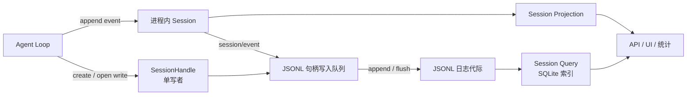

# Session 怎样保存，以及怎样供 UI 和查询读取

## 从事件到存储和读取结果

`core/session` 保存进程内的追加式日志；`session-persistence` 定义按会话获取的读写句柄；JSONL 提供方保存权威日志；projection、query、title、stats 和 telemetry 再从日志生成各自的读取结果。SQLite 用于查询索引或非 Session 业务存储，当前没有独立的 SQLite Session 日志提供方。



投影是根据事件计算出的状态，例如标题和使用量统计。缓存可从日志重建，不能反过来成为会话事实的写入入口。

## 句柄和单写者归属

[`SessionPersistence`](../../packages/session/session-persistence/src/index.ts) 的 `create()` 返回写句柄；`open(id, 'read')` 不占用写权限，`open(id, 'write')` 原子取得写权限，已有写者时拒绝。调用方通过句柄执行 `read`、`append`、`flush`、`close`，而 `stat` 和 `list` 只读取轻量元数据。关闭句柄会释放写权限。

Agent Loop 是生产路径中的写句柄获取者。创建时先准备 Session，恢复时先打开日志并补齐中断轮次，再完成 Agent setup。发布前写入 setup 期间产生的事件，发布后由 JSONL 提供方按 Session id 路由实时事件。卸载时先停止并等待 Agent，再写入结束事件、排空写入队列并关闭句柄。

## 后台写盘与 checkpoint

[`JsonlBackendTracker` 和 `JsonlSessionHandle`](../../packages/session/session-persistence-jsonl/src/storage.ts)负责已发布 Session 的事件路由、每句柄的串行写操作和后台批处理。首条待写事件启动固定批处理窗口，后续事件加入同一批；写入期间到达的事件另成一批。写盘失败保留待写事件并暂停自动重试，显式 flush 再重试或报告失败。

[`session-checkpoint-policy`](../../packages/session/session-checkpoint-policy/src/index.ts)在 `agent/pre-step`、`llm/stream` 和顶层 `tools/execute` 等待 `sessions.flush()`。模型流必须在历史持久化后才调用适配器，工具 body 必须在调用事实持久化后才开始。嵌套工具调用复用外层调用的 checkpoint。

```text
记录请求 / tool/call → sessions.flush() → 成功 → 模型或工具产生外部操作
                                      └→ 失败 → 不调用下游
```

这保证外部操作开始前，导致操作的历史已经保存；不能保证操作结果也已保存。例如文件写入后、`tool/result` 落盘前崩溃，恢复仍需将结果标为未知。

## JSONL 代际与格式迁移

JSONL 提供方支持原始文本与 Zstandard 压缩，默认使用带 checksum 的独立压缩帧保存 header 和追加批次。`compression: 'none'` 才生成可以直接逐行读取的 JSONL。写入路径同步文件并处理失败的部分追加，读路径不把 torn tail 当作完整事件；物理尾部修复与 Agent 层补 `turn/end` 是两种不同工作。

同一会话目录可能包含多个格式代际。提供方选择编号最高的规范代际，拒绝未来版本；受支持历史格式通过静态相邻迁移链生成当前逻辑事件。只读打开不发布文件，写打开在持有单写者权限时校验并排他发布当前代际。已提交的历史文件保持原样。版本与命名规则见[格式状态](../../docs/session-format-status.md)和 [`generation.ts`](../../packages/session/session-persistence-jsonl/src/generation.ts)。

`storage` 家族管理 Workspace、设置等非 Session 数据，可选择 JSON 或 SQLite。其数据库 schema 版本与 Session 格式版本各自独立，不应把通用存储后端当作 Session 日志实现。

## 附件与 Workspace 不是 Session backend 的附属表

[`attachment`](../../packages/attachment/attachment/src/index.ts)先验证并原子保存不可变图片字节，再允许 `user/message` 等模型可见事件记录可序列化的 `ImageAttachmentRef`。Session Log 只保存 content-addressed id、media type、字节数和尺寸，不保存浏览器路径、object URL、provider URL 或 base64；Provider adapter 发送模型请求时再通过 store 读取并校验 digest/metadata。本地实现把对象放在 `DSH_HOME/attachments/v1/objects`，不同 Session 或 fork 可以共享同一对象，因此当前没有自动 GC。

[`workspace`](../../packages/workspace/workspace/src/index.ts)则使用 `storage-domain` 保存 Workspace record、显示顺序、session candidate account 和 archive set。Session 归组仍要同时满足 account 中有 id，并且持久 Session header 的 canonical cwd 等于 Workspace path；删除 Workspace registration 不删除目录、live Session 或 Session log，只会让保留的 Session 回到 Ungrouped。它不写 Session Event，也不进入模型请求。

## 从日志计算读取结果

`session-projection` 注册计算规则；规则按事件顺序逐个更新结果。`session-projection-cache` 按 `seq` 缓存增量结果；title 和 stats 提供具体规则。缓存只用于加速，删除缓存后仍能从完整日志重建。只有事件写入日志后才能更新读取结果，不能先向 UI 发布预测状态。

Title Provider 根据符合条件的 prompt 生成 `session/title` event；`first-prompt` 只用首条 prompt，`all-prompts` 可以使用全部 prompt。公共 Service 处理手动刷新、失败后的备用方案、取消，以及多个结果同时返回时采用最后一个结果。标题写成事件而不是直接修改 Session metadata，因此可以重放标题来源和更新顺序。

## Query

`session-query` 定义可以查询哪些 Session、每次最多读取多少内容、父子 Session 关系和事件关系；SQLite Provider 添加全文检索；`tool-session-query` 给模型使用；`session-log-export` 负责导出。查询结果返回 Session 和事件 id，不暴露数据库内部行。大小限制应用到最终结果，防止单个巨大事件绕过条数限制。

## Telemetry

`session-telemetry` 根据 Session Event 以及 Agent 的创建和释放生成不依赖具体监控 Provider 的数据，OTel 包负责导出。遥测只读取已经提交的事件，不能阻止 Session 写入；导出失败也不能改变 Agent 行为。原始 Session 可能包含模型内容，部署者要在 exporter 配置中限制发送哪些数据。

## 不同读取方式何时能看到新事件

当前进程写入 Session 后可以立即读取；投影可以同步或增量更新；checkpoint 完成后才能保证 write-behind 已经落盘；查询会根据 live Session、准备中的读取结果或持久数据选择来源。因此不同读取方式可能短暂看到不同进度。系统在发起新的模型请求或外部操作前等待 checkpoint，避免动作已经发生而相关历史尚未保存。
