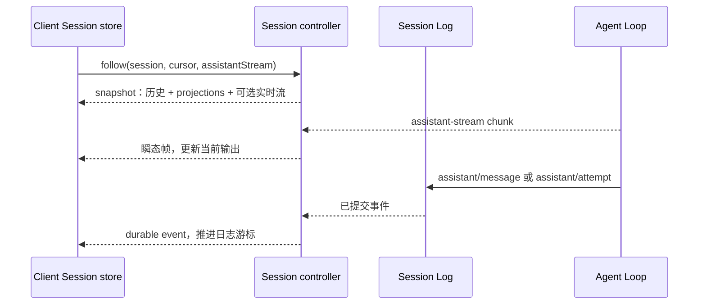

# Web Host 与 Client 架构

## 从服务端插件到浏览器插件

Host 提供 Web 服务、静态资源和领域 API。`dsh-web-app` 组合包同时选择 Host 与 Client 插件，浏览器端由 [`client/web`](../../packages/client/web/src/index.ts)装配 Cordis 上下文。UI 插件通过 Remote 调用服务端，不加载 Agent Loop 或 Node 文件系统实现。

```text
web-app bundle → Host 服务 + Client 插件图
  Host：Web server / Gateway / 领域 controller / Agent / Session
  Client：Connection / Remote controllers / Session store / UI renderers
```

桌面应用使用同一组业务服务和客户端插件，但由 Electron 通过私有 Desktop Host、字节管道与 `dsh-app://` 传递调用和资源。它不需要本机 HTTP 或 WebSocket 监听端口，启动过程见[组合与启动](03-composition-and-boot.md)。

## Client 状态与渲染职责

[`connection`](../../packages/client/connection/src/index.ts)负责远程传输；[`api/remotes` 的 Client 入口](../../packages/api/remotes/src/client/index.ts)安装领域控制器；[`client/store`](../../packages/client/store/src/index.ts)提供不依赖 React 的可观察状态；[`ui-renderer`](../../packages/client/ui-renderer/src/index.ts)将状态接到 React。`modules`、`hmr`、`locale`、主题和 slots 分别负责模块发现、热更新、语言与可撤销 UI 贡献。

UI 插件在自身 fiber 中注册 renderer 或 action，卸载时撤销。Conversation、工具、设置和轨迹分别贡献内容，不由一个中央 switch 枚举所有业务组件。

## Session 历史与实时输出如何到达 UI

[`Session controller.follow()`](../../packages/api/session-controller/src/history.ts)先发送历史快照、游标和投影状态，再发送游标后的持久事件；客户端请求实时输出时，还会接收当前 assistant stream 的快照和后续瞬态帧。Client Session store 校验顺序并更新视图，Conversation 将其转换为节点，renderer 负责绘制。



实时帧不占用 Session 日志序号。重新加载依靠已提交的 `assistant/message` 或 `assistant/attempt` 中嵌入的完整流；结算前发生进程丢失，不能恢复仅在界面显示过的 chunk。输入区的“正在发送”等临时状态也不能覆盖服务端记录。

`ConversationNodeDefinition` 与 keyed renderer 接入 user、assistant、tool、plan、goal 和 subagent 等节点。工具卡片按持久化的 tagged presentation metadata 渲染：call 支持 `generic`、`terminal`、`diff`，result 还支持 `read`、`search`、`web`；UI 不从结果文本猜卡片类型。

## Settings 与 Host 能力

Settings UI 分为 general、models、plugin inventory/plugins 等模块；写入必须调用 settings service 或 host API，不能直接修改内存中的 Cordis tree。Directory picker 有 auto、browse、native Provider，UI 只依赖共同接口。Plugin inventory 只显示 Loader 已生效的插件和配置，不能反过来保存另一份配置。

## UI 插件族

领域插件包括 agent preset、attachment、commands、deliverables、goal、jobs、message feedback、model selection、permission presets、plan、skill、subagent、tool、user questions、workflow 和 workspace。这些包大多只负责把服务端数据交给页面中的指定位置和 renderer，不负责保存或改变业务状态。详见[Web 与 Client package 指南](package-guide/web-and-client.md)。

## 风险与边界

插件式 UI 避免所有页面都堆进一个中央模块，但插件注册顺序、slot 接口、远程类型和 host/client 版本必须匹配。Client 使用独立 TypeScript 配置，不能引入只在 host 运行的 Node 模块；仓库用依赖图和编译检查强制这一点。重连后还要恢复订阅，因此必须区分只能实时看到的 Agent event 和可以从日志重放的 Session event。
